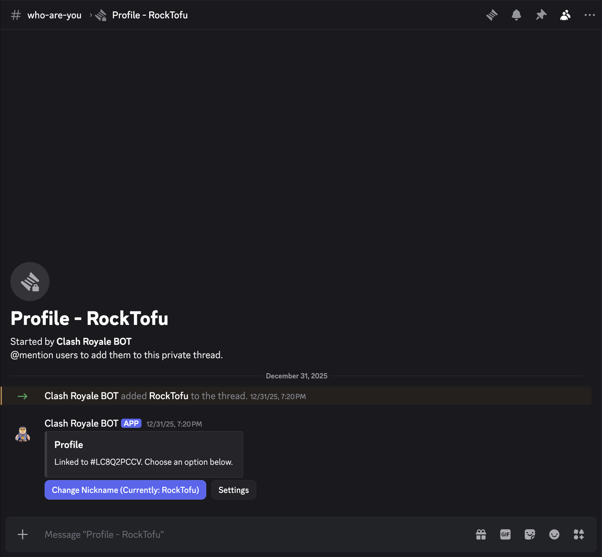
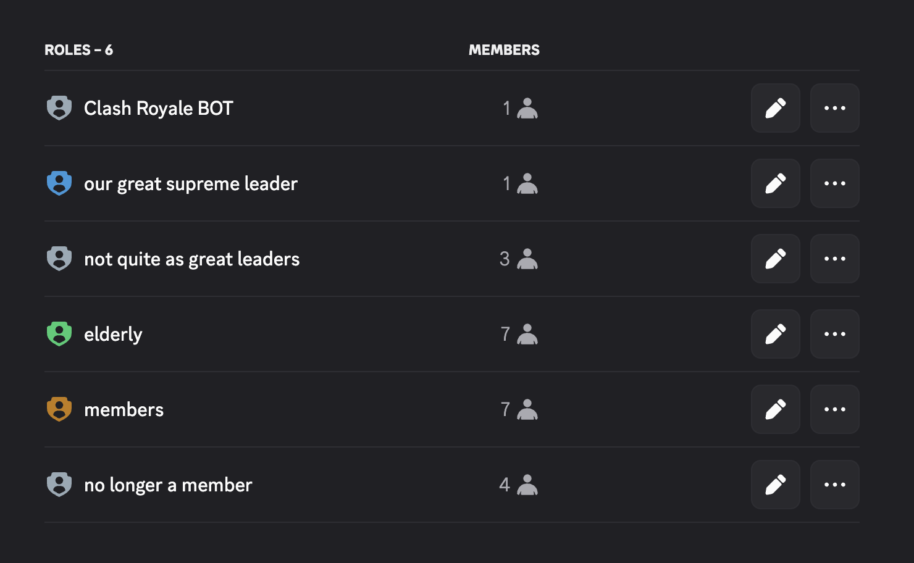
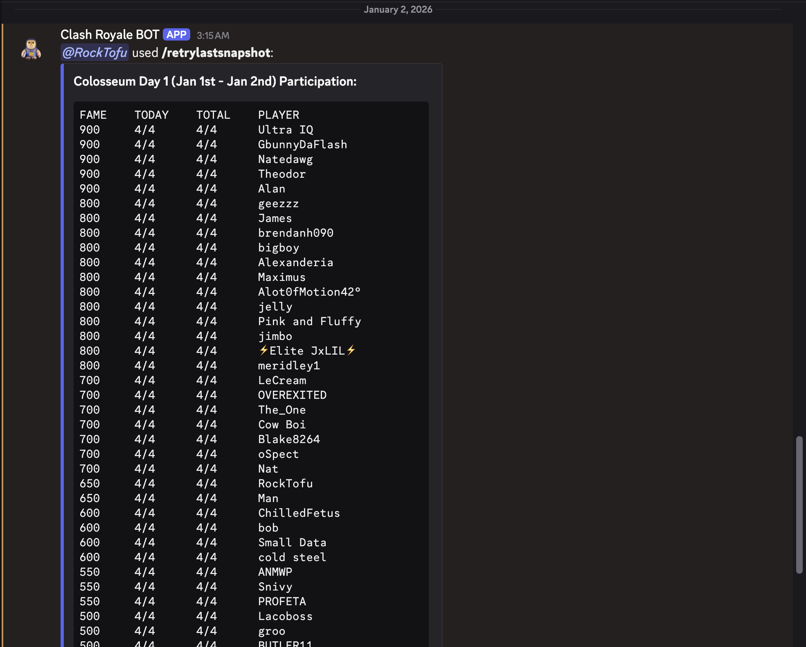

# StupidDiscordBot (Clash Royale)

Production-style Discord bot for a single Clash Royale clan: links Discord users to player tags, keeps Discord roles synced to the clan roster, and posts war participation logs on a schedule.

## What this project demonstrates

- **Real-world integration**: Discord (discord.js v14) + Clash Royale API
- **Type-safe config**: `.env` validated with `zod`
- **Idempotent background jobs**: role sync + war polling via `node-cron`
- **Local persistence**: SQLite (`better-sqlite3`) with job checkpoints to avoid spam

## Screenshots

- Per user profile thread

- Role sync outcome — member/elder/co-leader/leader roles

- A snippet of a war log

## Features

- **Onboarding (thread-based)**: unlinked users are guided to link their Clash tag in a dedicated verification/profile thread
- **Access control**: non-members are funneled into a non-member area ("vanquished") while clan members get standard access
- **Role sync**: assigns exactly one clan role (member/elder/co-leader/leader) based on the clan roster; removes stale roles
- **War monitoring**: posts participation deltas + periodic snapshots into a war logs channel, de-duplicated via persisted checkpoints
- **Utilities**: channel permission enforcement + open-spot notification subscriptions

## How it works (high level)

- **Source of truth**: Clash clan roster determines membership + rank
- **Linking**: `discord_user_id → player_tag` stored in SQLite
- **Sync loop**: cron jobs poll Clash endpoints and apply idempotent Discord updates
- **Anti-spam**: job state is persisted so the bot doesn’t repost the same information

## Prerequisites

- Node.js 20+
- A Discord server where you can manage roles/channels
- A Clash Royale API token (requires whitelisting your public IP): https://developer.clashroyale.com/

## Setup (instruction booklet)

### 1) Create your Discord application + bot

1. In the Discord Developer Portal, create an Application and add a Bot.
2. Copy:
   - **Bot token** → `DISCORD_TOKEN`
   - **Application ID** → `DISCORD_APP_ID`
3. Enable **Server Members Intent** (required for role syncing).

### 2) Invite the bot to your server

- Use an OAuth2 invite URL with the correct scopes/permissions.
- The bot must be able to:
  - Manage Roles (for role syncing)
  - Manage Channels/Threads (for verification thread UX)
  - Send Messages + Read Message History (for logs and onboarding)

### 3) Create a Clash Royale API token

1. Go to https://developer.clashroyale.com/ and create an API token.
2. **Whitelist your public IP** (required, otherwise requests will fail).
3. Copy the token into `CLASH_API_TOKEN`.

### 4) Create channels + roles in Discord

You’ll need these IDs (enable **Developer Mode** in Discord to “Copy ID”):

- Channels
  - General: `CHANNEL_GENERAL_ID`
  - Verification: `CHANNEL_VERIFICATION_ID`
  - War logs: `CHANNEL_WAR_LOGS_ID`
  - Announcements: `CHANNEL_ANNOUNCEMENTS_ID`
  - Non-member area: `CHANNEL_NON_MEMBER_ID`
- Roles
  - Non-member (“vanquished”): `ROLE_NON_MEMBER_ID`
  - Clan roles: `ROLE_MEMBER_ID`, `ROLE_ELDER_ID`, `ROLE_COLEADER_ID`, `ROLE_LEADER_ID`

### 5) Configure environment variables

1. Copy `.env.example` → `.env`
2. Fill in the required values.

Notes:

- `CLASH_CLAN_TAG` should look like `#ABC123` (the bot will normalize missing `#`).
- If you previously used legacy env names, `CHANNEL_VANQUISHED_ID` / `ROLE_VANQUISHED_ID` are still supported.

## Run

### Option A: One-click launchers (recommended for “just run it”)

- Windows: `run-bot.bat`
- macOS: `run-bot.command`
- Linux: `run-bot.desktop`

Each launcher runs: install (if needed) → build → register commands → start.

Optional behavior (via env vars):

- `INSTALL_AND_REGISTER=1` (default) — install deps + register commands
- `INSTALL_AND_REGISTER=0` — skip install + skip command registration
- Overrides (rare): `SKIP_INSTALL=1`, `REGISTER_COMMANDS=0`

### Option B: Terminal (developer-friendly)

- Install deps: `npm i`
- Build: `npm run build`
- Register commands: `npm run register:commands`
- Start: `npm start`
- Dev watch: `npm run dev`

## Slash commands

Commands and where they’re intended to be used:

- `/stats` — clan roster + stats utilities (general channel)
- `/warstats` — current war stats (war logs channel)
- `/warlogs` — war log publishing utilities (war logs channel)
- `/notifywhenspot` — subscribe to open-spot pings (non-member channel)
- `/notifynomore` — unsubscribe from open-spot pings

## Onboarding flow (what a new user experiences)

1. User joins the server (or participates in the verification channel)
2. Bot creates (or reuses) a private verification/profile thread
3. User pastes their player tag (example: `#ABC123`)
4. Bot validates the tag via the Clash API and stores the link in SQLite
5. Role sync assigns either:
   - a clan role (member/elder/co-leader/leader), or
   - the non-member role ("vanquished") if they are not currently in the clan

## Operations & maintenance

- **Scheduling**: cron strings are configurable via `.env` (`ROLE_SYNC_CRON`, `WAR_POLL_CRON`, etc.).
- **Database**: SQLite is local by default (`SQLITE_PATH=bot.sqlite`). WAL files may appear (`bot.sqlite-wal`, `bot.sqlite-shm`) and are not meant to be committed.
- **Clash API reliability**: if your IP changes, Clash API calls will fail until you update the whitelist.

## Repo map

- `src/index.ts` — bot boot + scheduler startup
- `src/config.ts` — `.env` parsing/validation
- `src/db.ts` — SQLite schema/helpers
- `src/clashApi.ts` — Clash Royale API client
- `src/discord/` — commands, onboarding, role sync, permission enforcement
- `src/jobs/` — scheduled jobs (role sync, war polling, empty spots)
